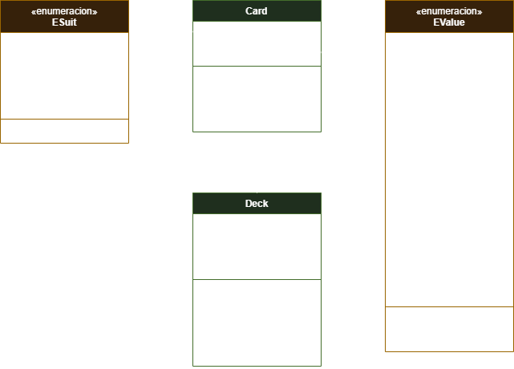
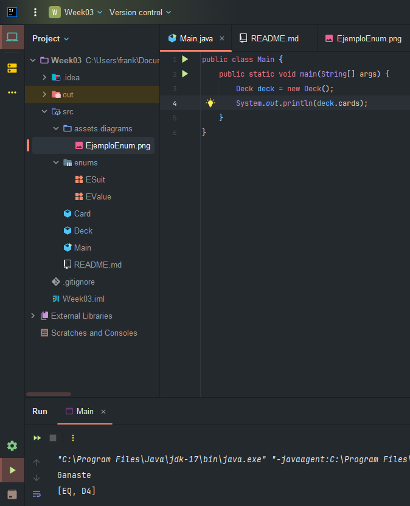
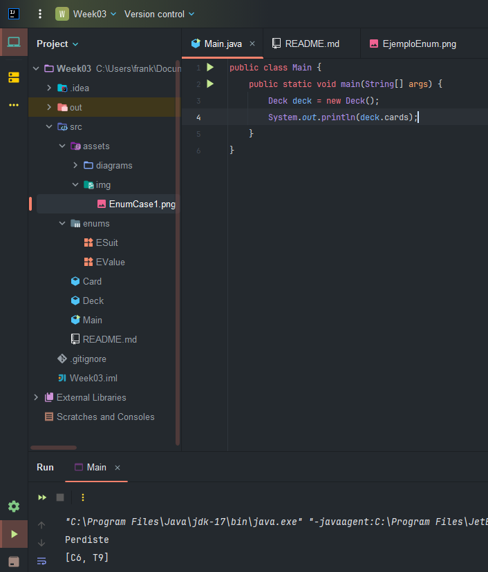
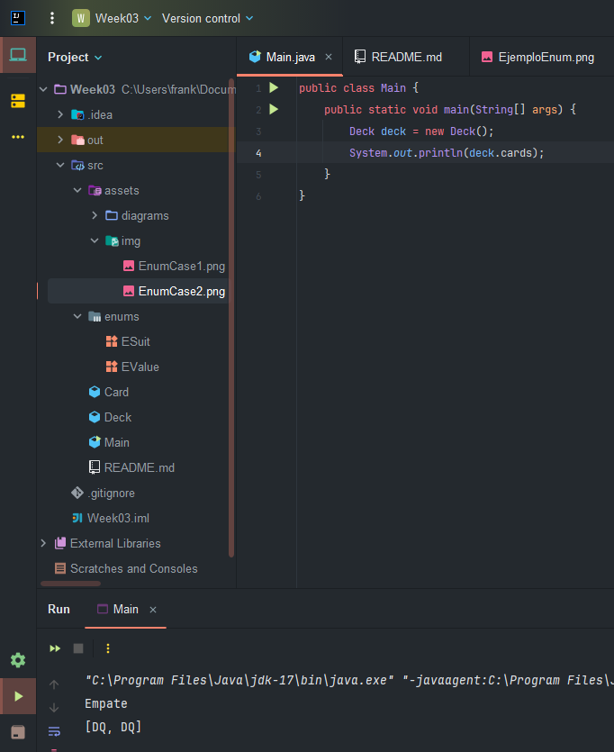

#  Juego de Cartas
Crear un enum llamado "Suit" the representara los símbolos de un mazo de cartas por ejemplo: TREBOL, DIAMANTES, CORAZONES, ESPADAS. Cada manojo tendría un símbolo asociado (T, D, C, E).

Crear una clase "Card" que representara a una carta, con atributos para su palo de tipo Suit y el “valor” asociado (2,3,4,5,6,7,8,9,10,J,Q,K,A) también con enums. Crear un constructor que soporte dos parámetros de tipo Suit y Valor, la clase debe estar diseñada de forma que una vez creado el objeto este no se pueda modificar.

Crear una clase "Deck" donde se implementará una lista de cartas, el constructor creará la lista de cartas ordenadas aleatoriamente.

En la clase main crear un mini juego, en donde la maquina tomara una carta al azar del Deck y nos otorgara a nosotros una carta, se comparan ambas cartas y el ganador es el que tiene la carta con más valor, considerar también el empate.

##  Diagrama de clases

## Casos de uso:

Tomar en cuenta que el primer elemento de la lista es la carta del usuario y la segunda carta es de la computadora

### Caso de uso 1:
 

### Caso de uso 2:

### Caso de uso 3:
