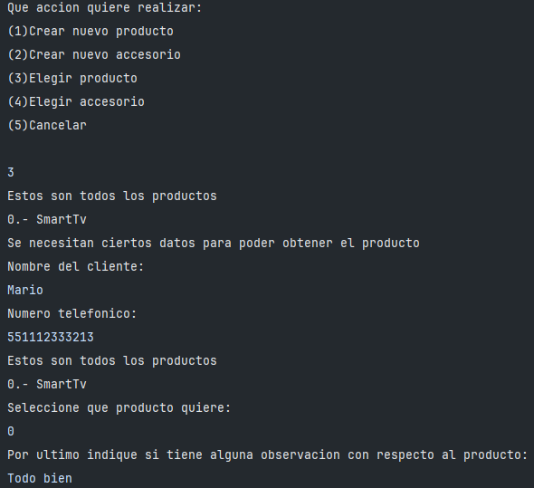

#  Juego de Cartas
Crear un enum llamado "Suit" the representara los símbolos de un mazo de cartas por ejemplo: TREBOL, DIAMANTES, CORAZONES, ESPADAS. Cada manojo tendría un símbolo asociado (T, D, C, E).

Crear una clase "Cards.assets.Card" que representara a una carta, con atributos para su palo de tipo Suit y el “valor” asociado (2,3,4,5,6,7,8,9,10,J,Q,K,A) también con Cards.assets.enums. Crear un constructor que soporte dos parámetros de tipo Suit y Valor, la clase debe estar diseñada de forma que una vez creado el objeto este no se pueda modificar.

Crear una clase "Cards.assets.Deck" donde se implementará una lista de cartas, el constructor creará la lista de cartas ordenadas aleatoriamente.

En la clase main crear un mini juego, en donde la maquina tomara una carta al azar del Cards.assets.Deck y nos otorgara a nosotros una carta, se comparan ambas cartas y el ganador es el que tiene la carta con más valor, considerar también el empate.

##  Diagrama de clases

## Casos de uso:

Tomar en cuenta que el primer elemento de la lista es la carta del usuario y la segunda carta es de la computadora

### Caso de uso 1:

### Caso de uso 2:

### Caso de uso 3:

#  Clases abstractas

Una conocida marca de dispositivos móviles acaba de lanzar una aplicación para uso exclusivo de las tiendas autorizadas a comercializar sus productos. Dicha aplicación sirve para registrar los dispositivos móviles en oferta, así como los servicios que ofrece de forma gratuita y también de paga.
Los productos se clasifican en dos tipos principales: productos finales y accesorios.
Ejemplos de productos finales: Smartphones, TV inteligentes, tabletas, Smart watch, etc.
Ejemplos de accesorios: cargadores, audífonos, cámaras, parlantes, teclados, fundas, baterías, etc.
Los servicios se clasifican en dos categorías:
Mantenimiento: actualizaciones, limpieza, formateo.
Reparación: reemplazo de partes, flasheo, actualización de hardware entre otros.
La aplicación cuenta con un menú desde donde se puede seleccionar si se desea un producto o un servicio, y al seleccionar uno de estos se accede a un sub menú con los productos o servicios disponibles, al seleccionar alguno se muestra el detalle del mismo y la opción de adquirir o cancelar para retornar al menú anterior.
Cuando un cliente accede a un producto o servicio, este se registra con la fecha, el nombre del cliente, su teléfono de contacto, el modelo del producto, y las observaciones, este se registra como una adquisición dentro de un historial para constancia de la atención de la tienda.
El menú también permite listar los productos y servicios adquiridos en el día.

## Diagrama de clases

## Casos de uso

### Crear un producto

### Elegir un producto

### Ver todas las adquisiciones del dia

# Herencia Multiple

Diseñar o implementar una aplicación con OOP, que permita modelar personajes de un juego de rol básico.
El personaje base tiene los siguientes atributos:
nombre: Nombre del personaje.
nivel: Nivel del personaje.
experiencia: Experiencia acumulada del personaje.
vida: Puntos de vida del personaje.
ataqueBase: Daño base del ataque del personaje.
defensaBase: Puntos de defensa base del personaje.
Métodos:
atacar(Personaje objetivo): Ataca al personaje objetivo, calculando el daño infligido en base al ataque del personaje atacante, la defensa del personaje objetivo y los modificadores del arma y la armadura equipados.
ganarExperiencia(int experiencia): Aumenta la experiencia del personaje.
subirNivel(): Sube el nivel del personaje si la experiencia acumulada es igual o mayor a la experiencia necesaria para el siguiente nivel.
mostrarEstado(): Muestra la información del personaje, incluyendo su nombre, nivel, experiencia, vida, ataque, defensa y objetos equipados.
A partir de esta clase, crear tres clases derivadas
Guerrero:
Atributos:
Fuerza: Modifica el ataque y defensa del personaje
Resistencia: Modifica la vida del personaje
Métodos:
golpear(Personaje[] personajes): Realiza un ataque base a varios personajes
curar(Personaje personaje): Puede recuperar hasta una tercera parte de la vida de un personaje.
inspirar(Personaje personaje): Puede aumentar el ataqueBase de un personaje en un tercio en el siguiente ataque.
Hechicero:
Atributos:
inteligencia: Nivel de habilidad para mejorar los hechizos aprendidos.
mana: Nivel de energía necesaria para ejecutar un hechizo.
Métodos:
curar(Personaje personaje): Puede recuperar hasta una tercera parte de la vida de un personaje.
conjurar(Personaje personaje): Ejecuta un hechizo a un personaje que puede: adormecerlo temporalmente.
Cazador
Atributos:
velocidad: Nivel de movilidad,
inteligencia: Nivel de habilidad para mejorar las habilidades de caza.
Métodos:
golpear(Personaje[] personajes): Realiza un ataque limitado a un grupo de personajes
inspirar(Personaje personaje): Puede aumentar la defensaBase de un personaje en un tercio en el siguiente ataque.
observar(Personaje personaje): Permite ver los atributos de un personaje cualquiera.
La aplicación tiene un menú que permite crear y listar personajes según el tipo, también permite seleccionar a un personaje y ejecutar las acciones del mismo, para las acciones que requieren varios personajes seleccionar algunos al azar. Si el personaje tiene su vida en 0 no puede ejecutar ninguna acción ni ser seleccionado.

## Diagrama de clases

## Casos de uso

